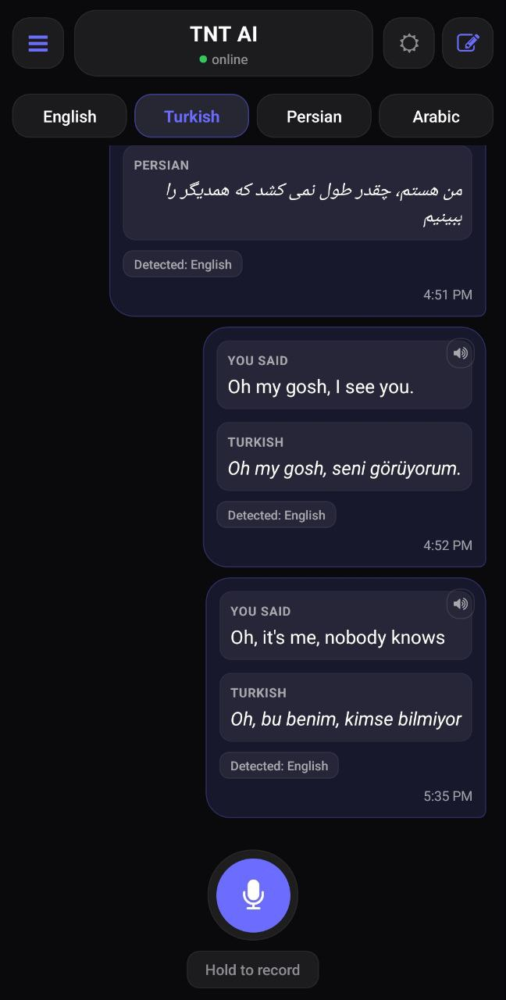
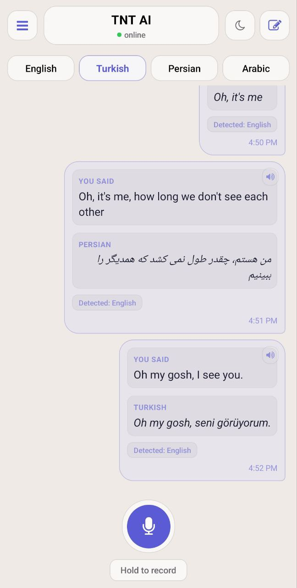
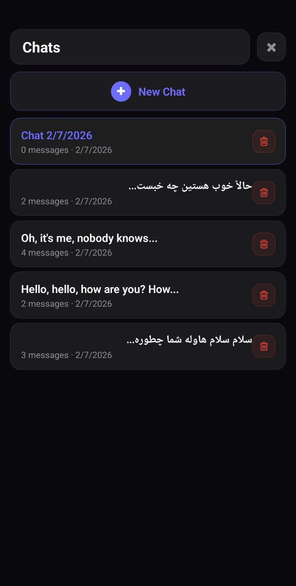
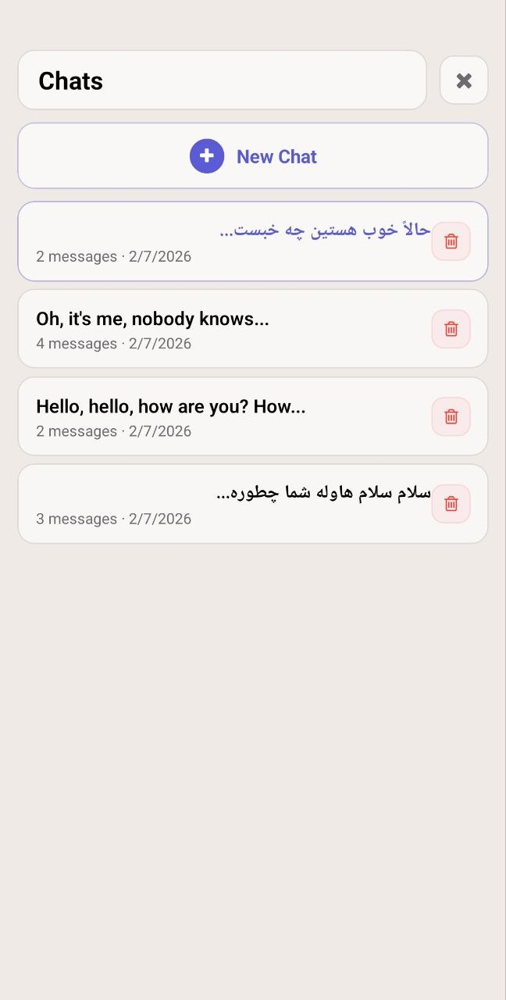

<p align="center">
  
  
  
  
</p>

<h1 align="center">🧨 TNT AI</h1>

<p align="center">
  <strong>Real-time Speech Transcription & Translation — Fully Offline</strong>
</p>

<p align="center">
  <a href="#features">Features</a> •
  <a href="#architecture">Architecture</a> •
  <a href="#tech-stack">Tech Stack</a> •
  <a href="#getting-started">Getting Started</a> •
  <a href="#api-reference">API</a> •
  <a href="#license">License</a>
</p>

<p align="center">
  
  
  
  
  
</p>

---

## What is TNT AI?

**TNT AI** is an open-source, privacy-first mobile app that transcribes speech and translates it in real time — all without sending data to third-party cloud APIs. The entire AI pipeline (speech recognition + translation) runs on your own server using **Faster Whisper** and **Argos Translate**, giving you full control over your data.

Speak in any supported language, and TNT AI will:
1. **Transcribe** your speech to text using Whisper
2. **Detect** the spoken language automatically
3. **Translate** the text to your chosen target language — completely offline

---

## Features

| Feature | Description |
|---|---|
| 🎤 **Live Transcription** | Hold-to-record with real-time speech-to-text via Faster Whisper |
| 🌍 **Multi-Language Translation** | English, Turkish, Persian & Arabic — fully offline with Argos Translate |
| 🔒 **Privacy First** | No third-party APIs — your audio never leaves your infrastructure |
| 🏝️ **Glass Island UI** | Frosted glass "island" design with `expo-blur` — both dark & light themes |
| 💬 **Chat-Style Interface** | Familiar messaging UI with transcription + translation in each bubble |
| 📚 **Conversation History** | Persistent local storage — browse and resume past sessions |
| 🔊 **Text-to-Speech** | Tap the speaker icon to hear any message read aloud |
| 📱 **Haptic Feedback** | Tactile response on record start/stop |
| 🟢 **Server Health Monitor** | Real-time backend status indicator in the header |
| 🌗 **Dark & Light Themes** | Elegant themed UI with one-tap toggle |

---

## Architecture

```
┌─────────────────────────────────────────────────────────┐
│                     Mobile App                          │
│            React Native · Expo · TypeScript             │
│                                                         │
│  ┌──────────┐  ┌──────────────┐  ┌───────────────────┐  │
│  │ Record   │  │ Glass Island │  │ Local Storage     │  │
│  │ Audio    │→ │ Chat UI      │  │ (AsyncStorage)    │  │
│  └────┬─────┘  └──────────────┘  └───────────────────┘  │
│       │                                                 │
└───────┼─────────────────────────────────────────────────┘
        │  POST /v1/transcribe_translate
        │  (audio file + target language)
        ▼
┌─────────────────────────────────────────────────────────┐
│                   Backend Server                        │
│               FastAPI · Python · Docker                 │
│                                                         │
│  ┌───────────────────┐     ┌──────────────────────────┐ │
│  │ Faster Whisper    │     │ Argos Translate          │ │
│  │ (Speech-to-Text)  │ ──> │ (Offline Translation)    │ │
│  │ VAD + beam search │     │ en↔tr↔fa↔ar              │ │
│  └───────────────────┘     └──────────────────────────┘ │
│                                                         │
│  FFmpeg (audio normalization) · Caddy (reverse proxy)   │
└─────────────────────────────────────────────────────────┘
```

---

## Tech Stack

### Mobile App
| Technology | Purpose |
|---|---|
| [React Native](https://reactnative.dev/) | Cross-platform mobile framework |
| [Expo SDK 51](https://expo.dev/) | Build toolchain & native APIs |
| [expo-router](https://docs.expo.dev/router/) | File-based routing |
| [expo-blur](https://docs.expo.dev/versions/latest/sdk/blur-view/) | Frosted glass UI effects |
| [expo-av](https://docs.expo.dev/versions/latest/sdk/av/) | Audio recording & playback |
| [TypeScript](https://www.typescriptlang.org/) | Type safety |
| [AsyncStorage](https://react-native-async-storage.github.io/async-storage/) | Persistent local data |

### Backend
| Technology | Purpose |
|---|---|
| [FastAPI](https://fastapi.tiangolo.com/) | High-performance Python API |
| [Faster Whisper](https://github.com/SYSTRAN/faster-whisper) | CTranslate2-optimized speech recognition |
| [Argos Translate](https://github.com/argosopentech/argos-translate) | Fully offline neural machine translation |
| [FFmpeg](https://ffmpeg.org/) | Audio format normalization |
| [Docker](https://www.docker.com/) | Containerized deployment |
| [Caddy](https://caddyserver.com/) | Automatic HTTPS reverse proxy |

---

## Getting Started

### Prerequisites

- **Node.js** 18+ & npm
- **Python** 3.10+
- **FFmpeg** installed and on PATH
- **Docker** & Docker Compose (for production deployment)

### 1. Clone the Repository

```bash
git clone https://github.com/iliyadindar/tnt-ai.git
cd tnt-ai
```

### 2. Start the Backend

```bash
cd backend

# Install Python dependencies
pip install -r requirements.txt

# Run the dev server (auto-reload)
uvicorn app:app --host 0.0.0.0 --port 8080 --reload
```

On first run, Whisper model weights and Argos language packs will be downloaded automatically.

**Or with Docker:**

```bash
cd backend
docker-compose up -d --build
```

### 3. Run the Mobile App

```bash
cd mobile

# Install dependencies
npm install

# Update the API URL in services/api.ts to point to your backend

# Start Expo dev server
npm start

# Or run directly on Android
npm run android
```

### 4. Build for Production (Android)

```bash
cd mobile

# Generate native project
npx expo prebuild --platform android --clean

# Build release APK
cd android && ./gradlew assembleRelease

# Build release AAB (for Play Store)
cd android && ./gradlew bundleRelease
```

---

## API Reference

### `POST /v1/transcribe_translate`

Transcribes audio and translates the result to the target language.

**Request** — `multipart/form-data`

| Field | Type | Required | Description |
|---|---|---|---|
| `file` | `File` | ✅ | Audio file (any format — converted to WAV internally) |
| `target_lang` | `string` | ❌ | Target language: `English`, `Turkish`, `Persian`, `Arabic` (default: `English`) |

**Response** — `application/json`

```json
{
  "transcript": "Oh my gosh, I see you.",
  "translation": "Oh my gosh, seni görüyorum.",
  "source_lang": "English"
}
```

### `GET /`

Landing page.

### `GET /privacy-policy`

Privacy policy page.

---

## Supported Languages

| Language | Code | Transcription | Translation |
|---|---|---|---|
| 🇬🇧 English | `en` | ✅ | ✅ |
| 🇹🇷 Turkish | `tr` | ✅ | ✅ |
| 🇮🇷 Persian | `fa` | ✅ | ✅ |
| 🇸🇦 Arabic | `ar` | ✅ | ✅ |

All translation pairs are supported (e.g., Persian → Turkish, Arabic → Persian, etc.). When a direct translation pack is unavailable, Argos automatically pivots through English.

---

## Project Structure

```
tnt-ai/
├── backend/
│   ├── app.py                 # FastAPI application & endpoints
│   ├── settings.py            # Configuration (model, ports, etc.)
│   ├── requirements.txt       # Python dependencies
│   ├── Dockerfile             # Container image
│   ├── docker-compose.yml     # Multi-service orchestration
│   ├── Caddyfile              # Reverse proxy config
│   └── models/whisper/        # Whisper model weights (auto-downloaded)
│
├── mobile/
│   ├── app/
│   │   └── index.tsx          # Main screen — glass island UI
│   ├── components/
│   │   ├── MessageBubble.tsx  # Chat bubble with transcript + translation
│   │   └── HistorySidebar.tsx # Conversation history panel
│   ├── services/
│   │   ├── api.ts             # Backend API client
│   │   └── storage.ts         # Local persistence layer
│   ├── functions/
│   │   ├── recordSpeech.tsx   # Audio recording logic
│   │   └── transcribeSpeech.tsx # API call + response handling
│   └── types/
│       └── index.ts           # TypeScript type definitions
│
├── docs/screenshots/          # App screenshots
├── LICENSE                    # AGPL-3.0
└── README.md                  # ← You are here
```

---

## Configuration

The backend is configurable via environment variables:

| Variable | Default | Description |
|---|---|---|
| `WHISPER_MODEL` | `medium` | Whisper model size: `tiny`, `base`, `small`, `medium`, `large-v3`, `large-v3-turbo` |
| `COMPUTE_TYPE` | `int8` | CTranslate2 compute type (use `int8` for CPU) |
| `CPU_THREADS` | `0` | CPU threads (0 = auto-detect) |
| `NUM_WORKERS` | `2` | Parallel transcription workers |
| `DEFAULT_TARGET_LANG` | `English` | Default translation target |
| `PORT` | `8080` | Server port |

---

## Screenshots

<p align="center">
  
  &nbsp;&nbsp;
  
</p>
<p align="center"><em>Chat interface — Dark & Light themes with glass island design</em></p>

<p align="center">
  
  &nbsp;&nbsp;
  
</p>
<p align="center"><em>Conversation history — Browse, resume, or delete past sessions</em></p>

---

## Privacy

TNT AI is designed with privacy at its core:

- **No cloud AI APIs** — Whisper and Argos run entirely on your server
- **No data collection** — Audio is processed in memory and immediately discarded
- **No analytics** — The app contains zero tracking or telemetry
- **Self-hosted** — You own and control all infrastructure

Read the full [Privacy Policy](https://iliyadindar.site/privacy-policy).

---

## Contributing

Contributions are welcome! Please feel free to submit a Pull Request.

1. Fork the repository
2. Create your feature branch (`git checkout -b feature/amazing-feature`)
3. Commit your changes (`git commit -m 'Add amazing feature'`)
4. Push to the branch (`git push origin feature/amazing-feature`)
5. Open a Pull Request

---

## License

This project is licensed under the **GNU Affero General Public License v3.0** — see the [LICENSE](LICENSE) file for details.

---

<p align="center">
  Made with ❤️ by <a href="https://github.com/iliyadindar">Ilia Dindar</a>
</p>
